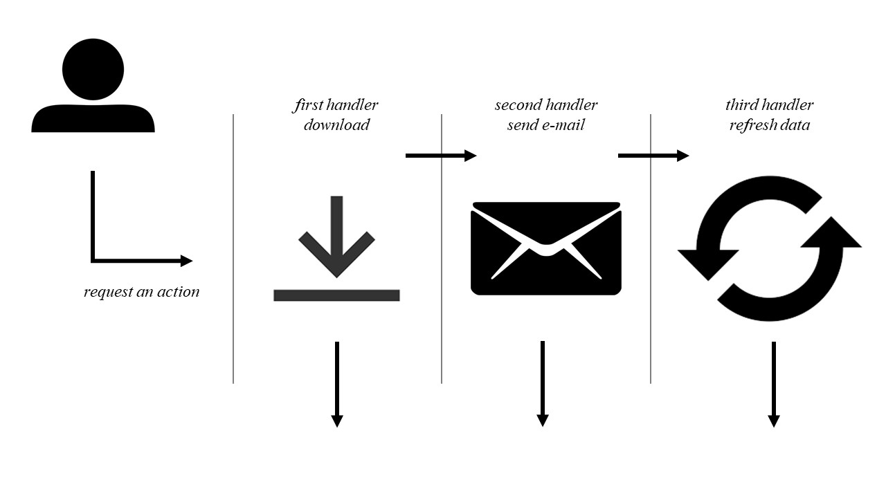

# Design Pattern - Chain of Responsibility #

## Description ## 

The main goal of this exercise was to understand the pattern chosen and create a practical example.

So, we used the Chain of Responsibility that contemplates a chain where each part is responsible for maintaining operation. 
When a request coming from the client, it will pass for this chain - e.g. `client request send an e-mail` so will be examined and execute in one of the steps.

To better exemplify, below we show a diagram of how this is working.



## The code ## 

We did a simple code that show what happens when it's buying a product and applied different discounts.

Check here the code and UML: [Apply different discounts code](cart-code/)

## Technical problems and solutions ##

I had problems to organizer the code in folders. My tests were put in subfolders, so when I tried to do an import from a parent folder or another folder, I received this error:

```
    ModuleNotFoundError: No module named [name file]
```

To resolve I used to bash and type this command on root folder: 

``` 
    export PYTHONPATH="$PWD"
```

Some refs.: [scratch file](scratch)
